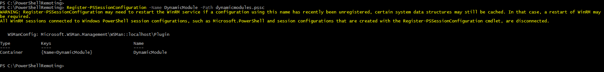
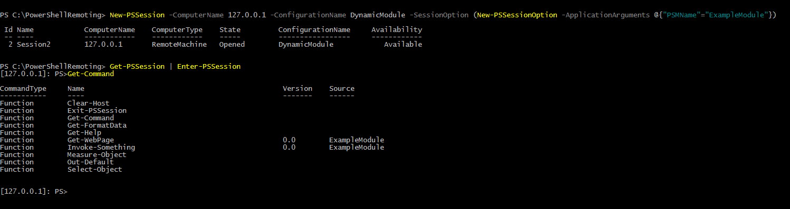
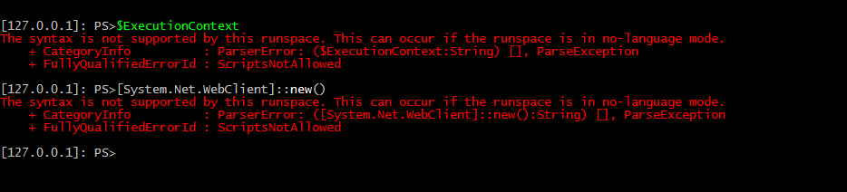
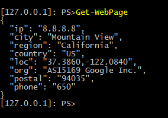

# Dynamic Module Session Configuration
Standby for repetition of the description from the root of the repository.

This example combines an extremely locked down PSSession Configuration file with a very flexible startup script which allows the dynamic loading of desired PowerShell modules into the PSSession at run-time.

While it can be quite dangerous to allow this startup script to load arbitrary PowerShell modules from the network, some precautions can be made (and are implemented) in the startup script to largely eliminate the issue of trusting the source of the PowerShell module.

This configuration is perfect for allowing multiple use-cases for PSRemoting without having to manage numerous JEA configs. You have the zero access config + whichever module you need at runtime.

# Full Documentation

## Elements of Dynamic Module

### dynamicmodule.pssc
This is the JEA configuration for this PSSession Configuration. It is fairly basic in functionality.

Important properties of this configuration are:

* Language mode is NoLanguage
* No cmdlets, scripts, programs, etc are visible to the runspace
* No providers are visible to the runspace
* The startup script is defined as dynamicmodulesstartup.ps1

### dynamicmodulesstartup.ps1
This is the PowerShell script used as a startup script by dynamicmodule.pssc

I've done my best to document in the script what is going on

Important properties of this script are:

* The script implements SSL certificate pinning in lines 6-28, you may comment these lines out to disable (not recommended)
* You may need to tweak lines 7, 8 and 25 to get CommonName verification working with your web server certificate
* You must fill in the following values
    * Trusted host running webserver with your modules - line 4
    * Subject of the chain certificate you wish to pin against - line 9
    * Public key of the chain certificate you wish to pin against - line 10
* This script accepts user input during session creation in the variable $PSSenderInfo.ApplicationArguments.PSMName (more on this in usage section)

The trusted host running your modules needs to be running a webserver with HTTPS. I highly recommend creating a folder on the server for your PowerShell modules.  

For example, say your domain is server.mysite.com, I would create a folder called modules and place each psm1 file into the folder.

Then I would define my trusted host on line 4 as:

    $url = "https://server.mysite.com/modules/$($PSSenderInfo.ApplicationArguments.PSMName).psm1"

## Installation

## Configurables 
For my example I have filled in the following values

* Trusted host is https://gist.githubusercontent.com/vector-sec/cbf51f4eac42e29dffe03b12a84c7453/raw/a5a609122689232d6388e370a0bb732decdcf02b/
* Subject of the chain certificate is CN=DigiCert SHA2 High Assurance Server CA, OU=www.digicert.com, O=DigiCert Inc, C=US
* Public key of the chain certificate is 3082010A0282010100B6E02FC22406C86D045... and so on

Note that GitHub uses Subject Alternative Names in their certificates. It isn't immediately obvious to me how to pull SANs so I set $cnName as shown below to keep things simple

    $cnName = "CN=www.github.com" 

## Install
Assuming you have PSRemoting already enabled you simply run

    Register-PSSessionConfiguration -Name DynamicModule -Path dynamicmodules.pssc

Doesn't get much simplier than that huh? :)

Note: If you need help getting PSRemoting up and running, feel free to reach out to me on Twitter!
## Usage
You can initiate a connection with the following commands

    $sessionOptions = New-PSSessionOption -ApplicationArguments @{"PSMName"="ExampleModule"}
    New-PSSession -ComputerName <YOUR COMPUTER NAME/IP> -ConfigurationName DynamicModule -SessionOption $sessionOptions

This one isn't quite as simple as the command for installation, so let me explain what this is actually doing.

-ComputerName is specifying the remote machine I want to connect to (in my case I connected to myself)  
-ConfigurationName is the name of the PSSC from the Install command. These must match, thought they don't have to be DynamicModule  
-SessionOption passes advanced options to the remote machine, an exhausive list is available on [MSDN](https://msdn.microsoft.com/en-us/powershell/reference/5.1/microsoft.powershell.core/new-pssessionoption) but we're really only interested in ApplicationArguments for our example  
-ApplicationArguments let's you specify, via a hashtable, arbitrary values that will be passed to the remote endpoint, accessible in scripts under $PSSenderInfo.ApplicationArguments.<HashTableKey>  

# Closing thoughts

So as mentioned in the beginning of this doc, we're operating in NoLanguage mode, which means we can't do much of anything in our runspace.

The good news is, our startup script and any modules imported by it operate in FullLanguage mode. Consider my [example module](https://gist.github.com/vector-sec/cbf51f4eac42e29dffe03b12a84c7453)

The function Get-WebPage uses a dotNet type, System.Net.Webclient, to perform a download. Even though we just tried to use this type ourselves without success, the function won't have any trouble.

